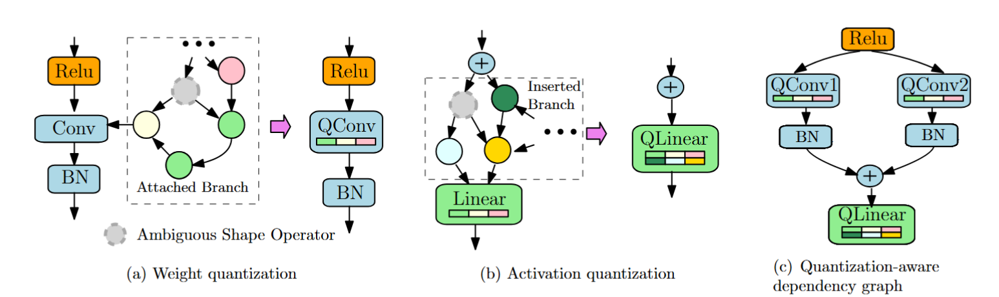

# GETA
This repo provides the implementation of **GETA**, a **G**eneric, **E**fficient **T**raining framework that **A**utomates joint structured pruning and mixed precision quantization. GETA is architecture agnostic and user-friendly. Using **GETA**, one can compress a wide range of neural network architecures including but not limited to convolutional neural networks, transformers, vision transformers, and small language models with minimal engineering efforts on the user side.

## Features
The GETA framework features two essential modules, quantization-aware dependency graph (QADG) analysis and quantization-aware structured sparse optimizer (QASSO).

* Graph Analysis. **GETA** first constructs the pruning search space that supports structured pruning. Careful computational graph optimization is introduced to handle both weight quantization and activation quantization. The following figure visualizes the general idea of how graph analysis is performed.

  

* QASSO Optimizer. **GETA** next deploys **QASSO** optimizer to figure out the tradeoff between pruning and compression given the compression constraints. QASSO is a white-box optimizer for an optimization problem with both sparisty and quantization constraints, which is formulated as
```math
\begin{aligned}
\min_{x,d,q_m,t} & f(x, d, q_m, t) \\
\text{s.t.} & \text{Card}\{g \in \mathcal{G} \mid [{x}]_g = 0 \} = K, \\
& b_i \in [b_l, b_u], \quad i \in \mathcal{L},
\end{aligned}
```
where $\mathcal{G}$ represents the set of parameter groups and $K$ represents the target sparsity ratio and $[b_l, b_u]$ specifies the target bit width range, and $\mathcal{L}$ denotes the index set of layers that have parameterized quantization layers added. By white-box, one can explicity control the sparsity level $K$ and the bit width range $[b_l, b_u]$.

## How to use this
We will add more details to this section once the code is officially released.

## Instructions to contributors
We would greatly appreciate the contributions in any form, such as bug fixes, new features and new tutorials, from our open-source community.

## Known issues (Work on progress)
The code and the tutorial is still ongoing. The full version is coming soon. Stay tuned. Thanks!

## BibTeX
If you find this repo useful for your research, please consider citing our paper:

```
@article{qu2025automatic,
  title={Automatic Joint Structured Pruning and Quantization for Efficient Neural Network Training and Compression},
  author={Qu, Xiaoyi and Aponte, David and Banbury, Colby and Robinson, Daniel P and Ding, Tianyu and Koishida, Kazuhito and Zharkov, Ilya and Chen, Tianyi},
  journal={arXiv preprint arXiv:2502.16638},
  year={2025}
}

```


